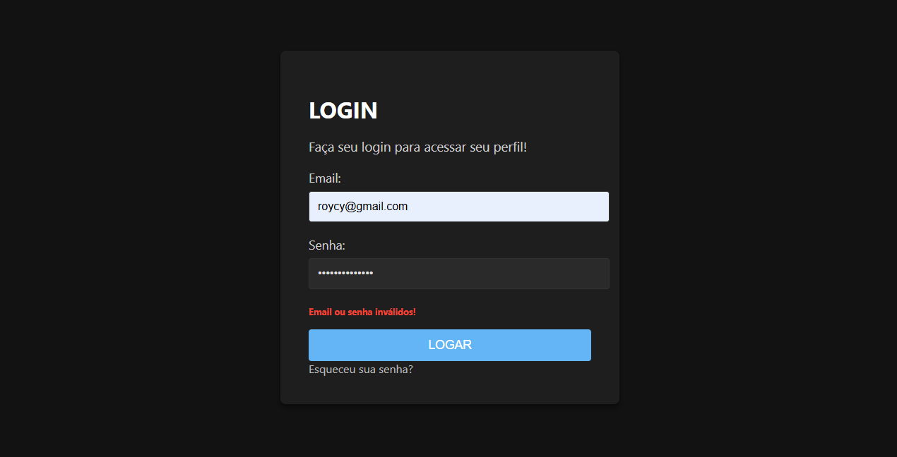

# LoginPage

## Descrição

Este é um projeto de uma tela de login básica, desenvolvida com HTML, CSS e JavaScript. O objetivo é demonstrar uma interface de autenticação simples e funcional, servindo como um ponto de partida para sistemas mais complexos.

## Funcionalidades

* Interface de login limpa e intuitiva.
* Validação de email e senha no frontend.
* Simulação de autenticação com dados de um arquivo JSON.
* Redirecionamento para uma página de sucesso após o login.

## Como usar

1.  Clone o repositório:

    ```bash
    git clone https://github.com/roycyeduardo/LoginPage.git
    ```

2.  Abra o arquivo `index.html` em seu navegador.

3.  Insira um email e senha inserido em `accounts.json` nos campos correspondentes.

4.  Clique no botão "LOGAR" para simular o login.

## Tecnologias utilizadas

* HTML5
* CSS3
* JavaScript

## Melhorias futuras

* Implementar autenticação no backend com um banco de dados real.
* Adicionar funcionalidades de "Lembrar senha" e "Cadastro de usuário".
* Melhorar a validação de formulário e a segurança do login.
* Implementar a funcionalidade de "Esqueci minha senha".

## Contribuição

Contribuições são bem-vindas! Se você tiver alguma sugestão de melhoria ou encontrar algum problema, sinta-se à vontade para abrir uma issue ou enviar um pull request.

## Visualizar Website

[Clique aqui](https://roycyeduardo.github.io/LoginPage) para visualizar o website.

## Imagem do projeto


